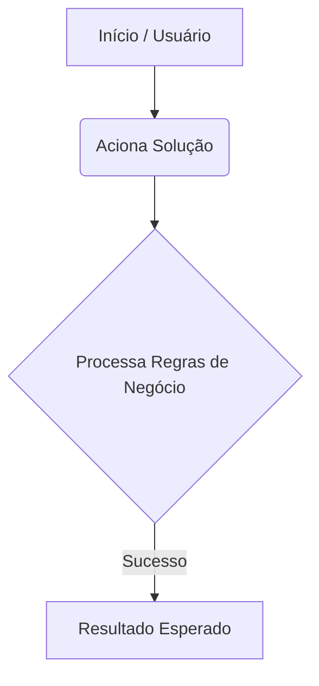

# 🔄 Fluxo e Arquitetura - Portfolio Streamlit

Abaixo está mapeado o fluxo básico de execução e ciclo do sistema.

### 🗺️ Diagrama de Processo

> 💡 *Dica: Você pode editar o bloco acima diretamente usando a sintaxe nativa do Mermaid no GitHub.*
